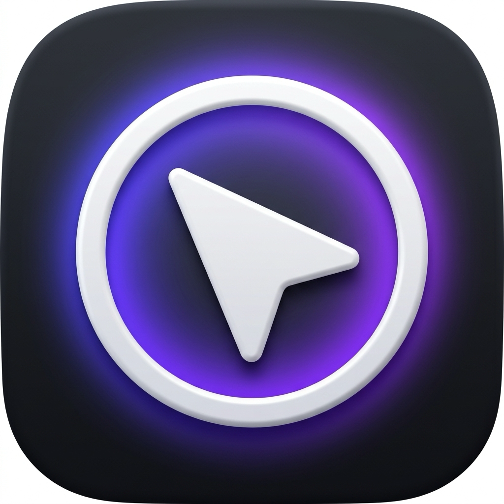

<p align="center">
  
</p>

# Jiggler

A lightweight, premium macOS menubar application built in pure Swift that keeps your system active. It prevents sleep and idle states with customizable jiggle styles, smart idle detection, and battery safety features.


---

## ✨ Features

- **🎯 Precision Jiggle Styles**:
  - **Subtle**: Moves the cursor by a microscopic 1px shift and snaps it back in 0.1s.
  - **Random Drift**: Moves the cursor up to 5px in any direction.
  - **Prevent Sleep (No Move)**: Uses native macOS Power Assertions (`IOPMAssertionCreateWithName`) to keep the display awake without any physical mouse movement.
- **⏱️ Flexible Intervals**: Choose between 10 seconds, 30 seconds, 1 minute, 5 minutes, or 10 minutes.
- **🧠 Smart Activation**: Enable **Only when Idle** with customizable idle timeouts (1 or 5 minutes) using native IOHIDSystem idle monitoring.
- **🔋 Battery Guard**: Automatically pauses execution when battery levels fall below 20% to conserve power when discharging.
- **🎨 Premium Adaptive Aesthetics**:
  - Automatically adapts to macOS light/dark modes (`isTemplate = true`).
  - Active state features a gorgeous semi-transparent template glow.
  - Interactive battery guard state automatically flags warnings via status indicators.
- **🚀 Launch at Login**: Configurable Launch Agent setup to start with macOS.

---

## 🛠️ Requirements & Compilation

Jiggler is written in pure Swift and targets macOS. It does not require Xcode to compile and can be built directly using the system's compiler.

To compile:
```bash
swiftc -O -sdk $(xcrun --show-sdk-path) jiggler.swift -o Jiggler
```

---

## 📄 License

This project is open-source. Feel free to modify and build upon it!
